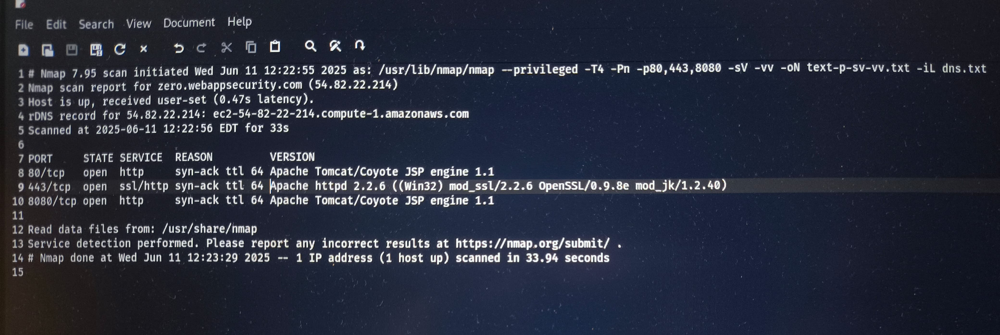
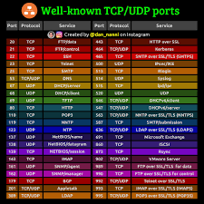
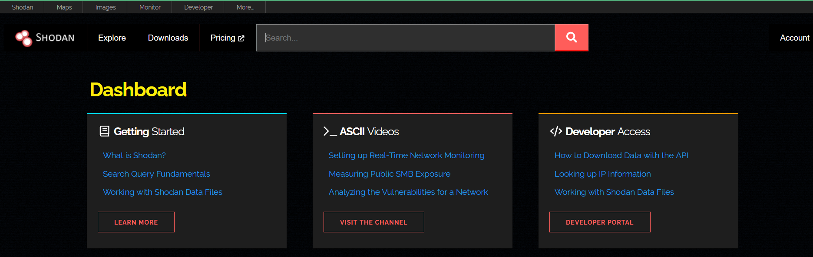

# 🛡️ Cyber Security - Day 07

## 🔍 Nmap Command and Options

`nmap` is a powerful network scanning tool used to discover hosts, services, and open ports in a network.

### 📘 Basic Syntax

```bash
nmap [options] [target]
```

### 🧰 Common Options and Their Usage

| Command | Description |
|---------|-------------|
| `nmap -sS` | TCP SYN scan (default, stealthy scan) |
| `nmap -sT` | TCP Connect scan |
| `nmap -sU` | UDP scan |
| `nmap -sV` | Detect service version |
| `nmap -O` | Detect operating system |
| `nmap -A` | Aggressive scan (includes OS detection, version detection, script scanning, and traceroute) |
| `nmap -p` | Scan specific port(s) (e.g., `-p 22,80,443`) |
| `nmap -Pn` | No ping, treats all hosts as online |
| `nmap -T4` | Set timing template (faster scan) |
| `nmap -v` | Increase verbosity |
| `nmap -oN result.txt` | Save scan output to file |
| `nmap -iL targets.txt` | Scan list of targets from file |

---

## 🧪 Scanning `zeroappsecurity.com`

We used `nmap` to scan `zeroappsecurity.com` to observe its ports and services.

### ✅ Example Command:

```bash
nmap -sS -sV -O -Pn zeroappsecurity.com
```

### 🧾 Result Interpretation:

- **Open Ports:** Displays which ports are open.
- **Service Version:** Detects the version of services (like Apache, nginx, SSH).
- **OS Detection:** Tries to guess the operating system.
- **Ping Disabled:** Using `-Pn` in case ICMP (ping) is blocked.

> Note: Always ensure you're authorized before scanning any site!

---

## 📚 TCP and UDP Ports (Based on Wikipedia)

- **TCP (Transmission Control Protocol):**
  - Connection-oriented.
  - Examples: HTTP (80), HTTPS (443), SSH (22), FTP (21), Telnet (23).
  
- **UDP (User Datagram Protocol):**
  - Connectionless, faster but less reliable.
  - Examples: DNS (53), DHCP (67/68), SNMP (161), TFTP (69).

📘 Learn more:  
[Wikipedia - TCP/UDP Port List](https://en.wikipedia.org/wiki/List_of_TCP_and_UDP_port_numbers)

---

## 🌍 What is Shodan.io?

[Shodan.io](https://www.shodan.io) is a **search engine for internet-connected devices**. It allows cybersecurity professionals and researchers to:

- Discover exposed services, devices, and systems.
- Search for specific banners, versions, ports, or vulnerabilities.
- Monitor their network for open devices.

### 🔧 Example Uses:

- Find webcams running with default credentials.
- Identify industrial control systems (ICS) on the internet.
- Monitor smart home devices or IoT exposures.

> Always use this tool ethically and with legal permissions.

---

## 📷 Screenshots / Visuals

> (🔁 Replace these placeholders with actual image links or GitHub-uploaded image files)


  
- Example `nmap` scan result for zeroappsecurity.com:
  
  
- TCP/UDP Port Wiki Screenshot:
  
  
- Shodan Dashboard Preview:
  

---

## ✅ Summary

- `nmap` helps identify active hosts, ports, and services.
- Use `zeroappsecurity.com` for safe practice and testing.
- Understand the role of TCP/UDP ports from Wikipedia.
- `Shodan.io` is a powerful search engine for discovering internet-facing devices.

---

🔐 Stay ethical and never scan or probe systems without explicit permission.
